# Shirazi & Associates

A bilingual (English / Farsi) marketing homepage for a fictional Toronto immigration and family law firm. Built as a design concept — dark, editorial, and structured around a Persian geometric grid instead of stock photography or decorative motifs.

> **Note:** "Shirazi & Associates" is a fictional firm. This is a design/frontend mockup, not a production client site.

## Screenshots

English build, desktop (1440×900) and mobile (390×844).

| | Desktop | Mobile |
|---|---|---|
| **Home** | 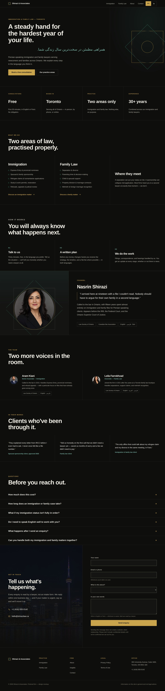 | 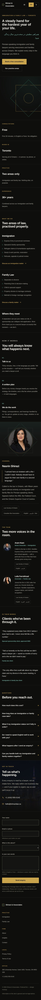 |
| **Immigration** | 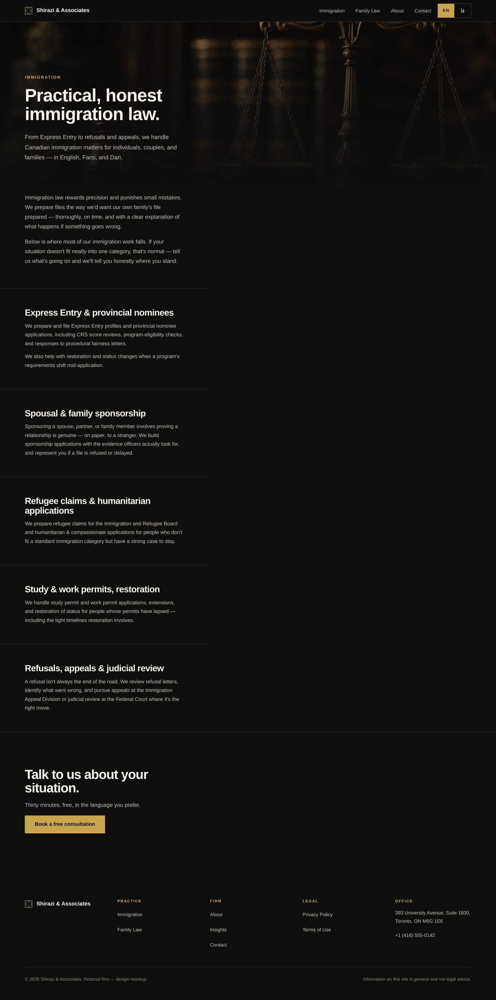 | 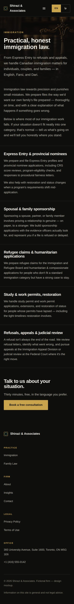 |
| **Family Law** | 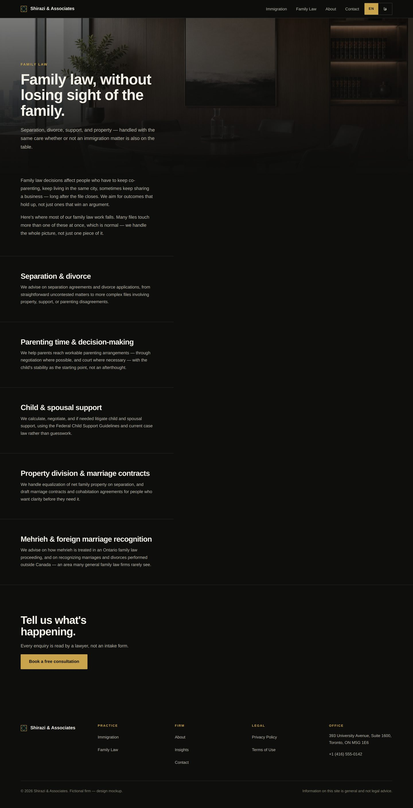 | 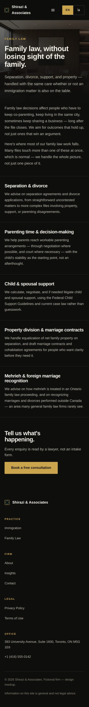 |
| **Insights (blog index)** | 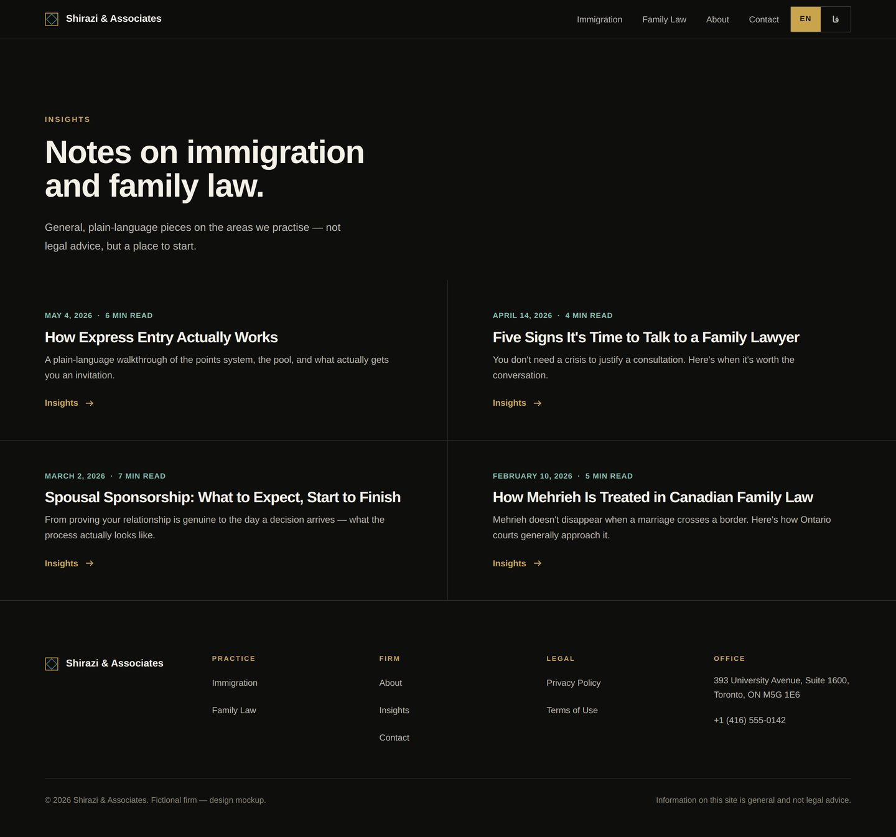 | 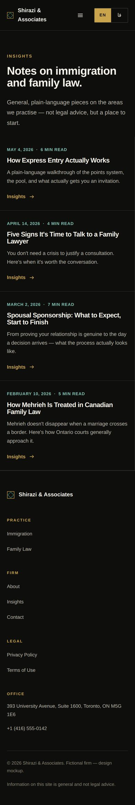 |
| **Insights (article)** | 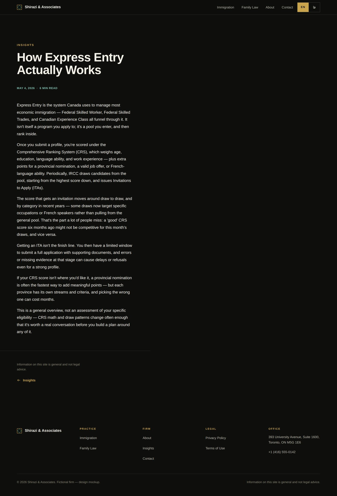 | 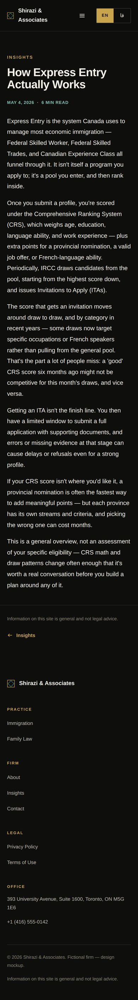 |
| **Privacy Policy** | 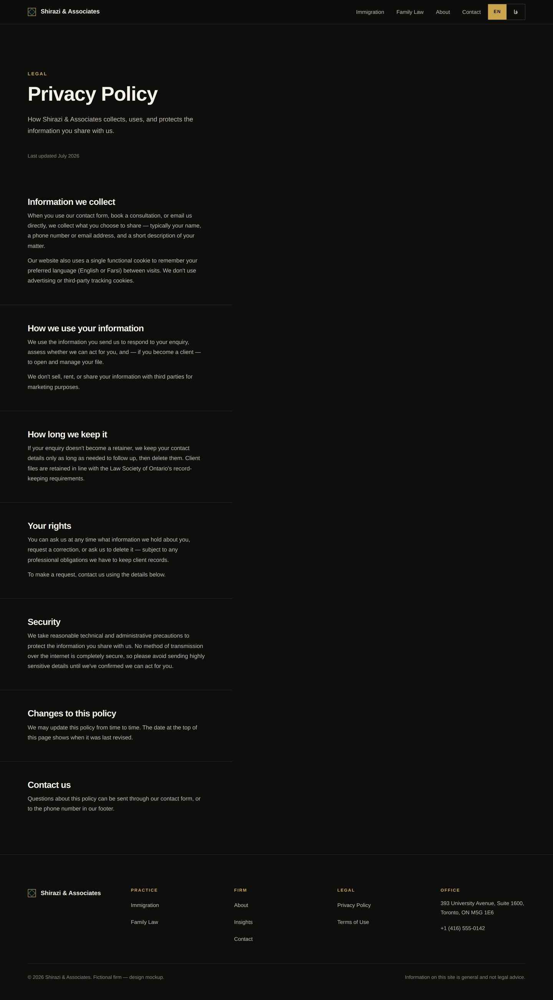 | 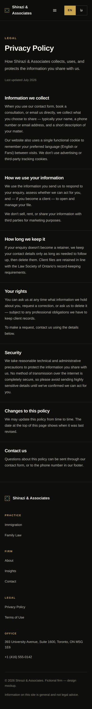 |
| **Terms of Use** | 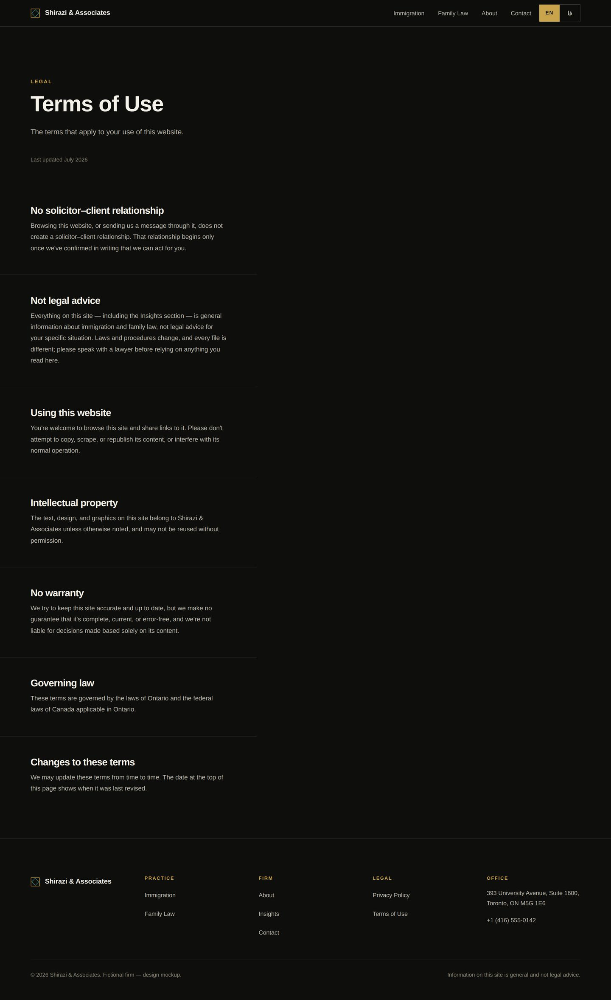 | 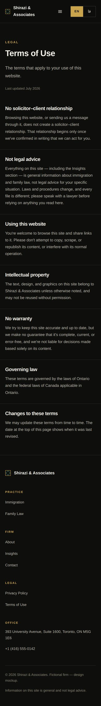 |

Farsi (`/fa`) renders the same pages fully mirrored under `dir="rtl"` — see [Localization](#localization) below.

## Highlights

- **Full bilingual RTL mirror.** Switching to Farsi doesn't just right-align text — the entire layout mirrors (nav, grid, bullets, icons) via CSS logical properties, and the page ships correct `lang`/`dir` attributes, canonical URLs, and hreflang alternates for both locales.
- **Girih grid.** The layout system is built on the same construction logic as traditional Persian geometric tilework (an eight-point star reduced to its underlying square/circle geometry), used structurally rather than as decoration.
- **Bilingual hero echo.** The hero headline is paired with the same line in the other language, and the pairing reverses correctly depending on which locale is active — Farsi is never permanently "the translation."
- **No stock photography.** The one portrait placeholder is the firm's geometric mark, deliberately cropped so it bleeds past its frame.
- **Motion with intent.** A single staggered scroll-reveal, transform/opacity only, fully disabled under `prefers-reduced-motion`.

## Stack

- [Nuxt 4](https://nuxt.com) (Vue 3, static generation)
- [@nuxtjs/i18n](https://i18n.nuxtjs.org) for locale routing, `hreflang`, and RTL metadata
- Plain CSS with design tokens — no UI framework or component library

## Getting started

```bash
npm install
npm run dev       # http://localhost:3000
```

Other scripts:

```bash
npm run generate  # static build → .output/public
npm run preview   # preview the static build locally
```

## Deployment

Deployed to GitHub Pages via `.github/workflows/deploy-pages.yml`, which builds on every push to `master` and publishes `.output/public`. Live at **https://roshalink.github.io/shirazi-associates/**.

It's a project site, not a custom domain, so the build runs with `NUXT_APP_BASE_URL=/shirazi-associates/` and `nitro.preset: 'github-pages'` (writes `.nojekyll`, prerenders `/404.html`) — both set in `nuxt.config.ts`. Local dev is unaffected; the base path only applies to the deployed build.

## Project structure

```
app/
  app.vue                 # shell: skip link, header, page, footer
  pages/index.vue          # homepage section order
  components/
    SiteHeader.vue         # sticky nav + language toggle
    HeroSection.vue         # headline, bilingual echo, hero mark
    FactsGrid.vue           # three-cell stat row
    PracticeAreas.vue       # immigration / family law / overlap
    ProcessSteps.vue        # three-step "how it works"
    CounselBio.vue          # attorney bio, cropped mark portrait
    ContactSection.vue      # enquiry form (frontend-only, no endpoint wired)
    SiteFooter.vue
    GirihMark.vue           # the firm's geometric mark, three scales
    LangToggle.vue
  composables/
    useReveal.ts            # staggered scroll-reveal, respects reduced motion
  assets/css/
    main.css                # tokens, girih grid, motion, RTL rules
i18n/locales/
  en.json
  fa.json
```

## Localization

Locale strings live in `i18n/locales/{en,fa}.json`. Routing uses `prefix_except_default`, so English is served at `/` and Farsi at `/fa`. RTL direction is declared per-locale in `nuxt.config.ts` and applied to `<html>` via `useLocaleHead`, which also handles canonical/hreflang tags.

Component styles that need different treatment per direction key off `html[dir="rtl"]` rather than duplicating markup — see `app/assets/css/main.css` and the `<style scoped>` blocks in individual components for examples (type scale, line-height, icon mirroring, bullet alignment).

## Known gaps

- The contact form validates and shows a submitted state but has no backend — no request is actually sent.
- Farsi copy was drafted for this mockup and should be reviewed by a native speaker before any real use, particularly the family-law service list.
- Only the homepage exists. Practice-area, about, and contact pages referenced in the nav are anchors on this page, not separate routes.

## License

Private / unpublished. All rights reserved.
